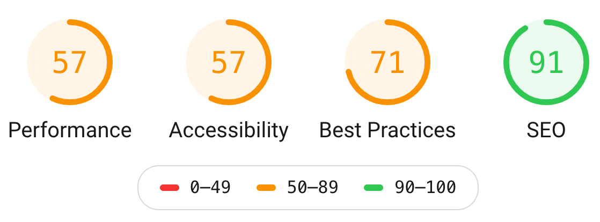
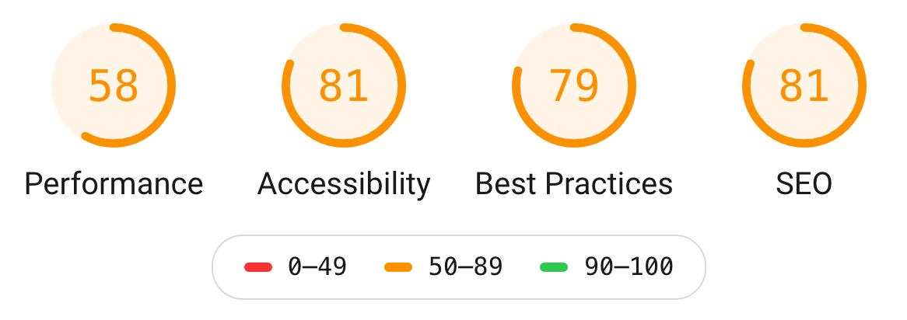

## HTML Tutorial

1. **Thymeleaf**

   - https://www.youtube.com/watch?v=4-Mhrh3M0co
   - http://itutorial.thymeleaf.org/exercise/1

   - Installation:

     - Java
     - Apache Maven
     - https://spring.io/tools

   - Demo: Cant be done, as we required to have above installation

2. **React**

   - https://magic.reactjs.net/htmltojsx.htm

   ```
    cd ./react
    make serve-dev
    make serve-prod
   ```

3. **VueJS**

```
cd ./vuejs
make dev
```

4. **UI Template**

```
- open ui-template/index.html in vs code
- click: GO Live
```

5. **JQuery**

```
- open jquery/index.html in vs code
- click: GO Live
```

6. **Javascript**

```
- open javascript/index.html in vs code
- click: GO Live
```

7. **FreeMaker**

```
cd ./freemaker
make dev

- open freemaker/index.html in vs code
- click: GO Live
```

8. **Handlebars**

```
- open handlebars/index.html in vs code
- click: GO Live
```

9. **AngularJS**

```
cd ./angularjs
make dev
```

## Why Do we need UI Development Team?

- [Addidas](https://shop.adidas.co.in/)
  

- [Skava](https://www.skava.com/)
  
